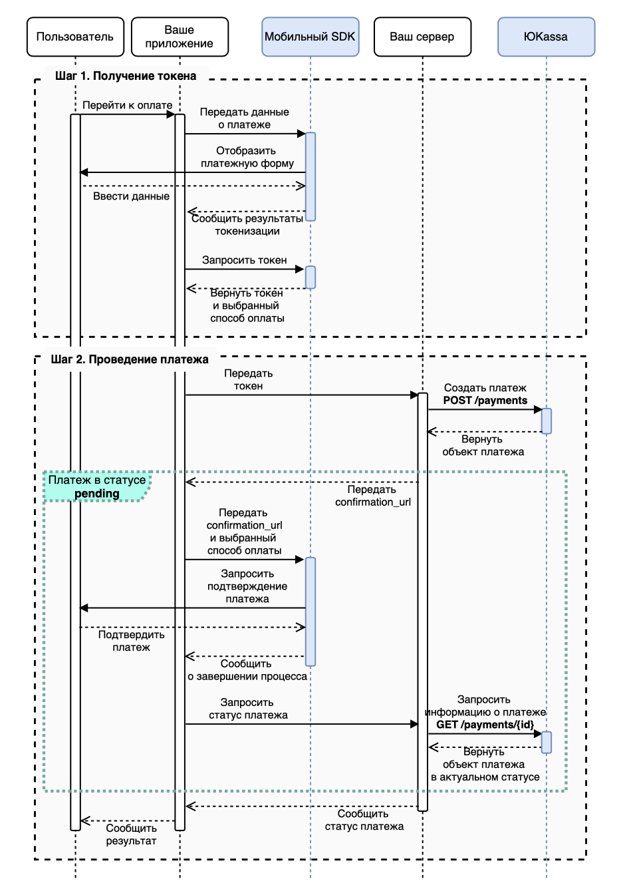
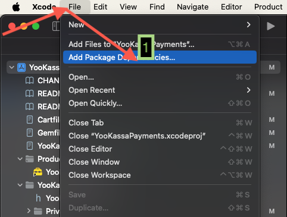
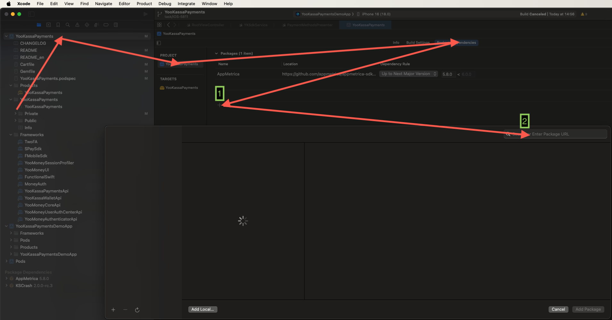
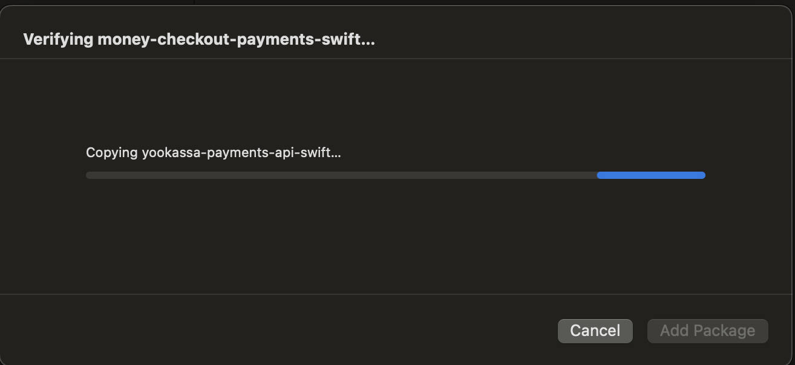
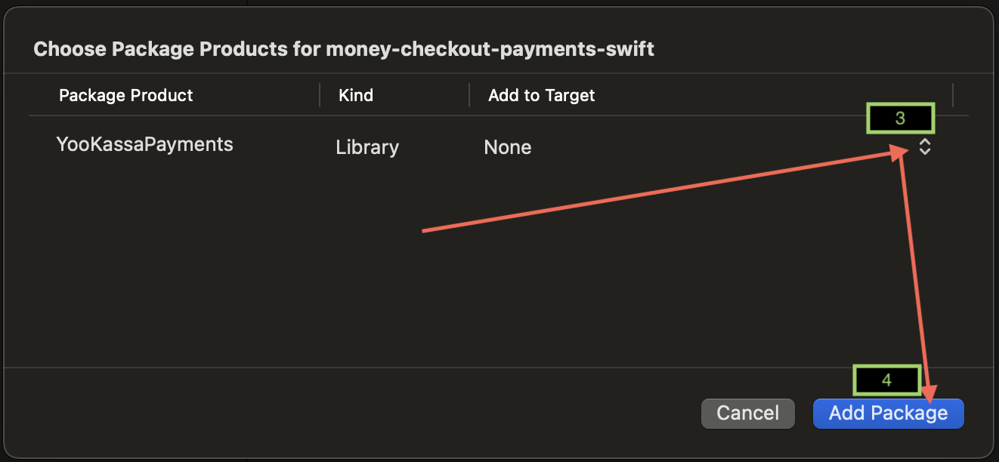
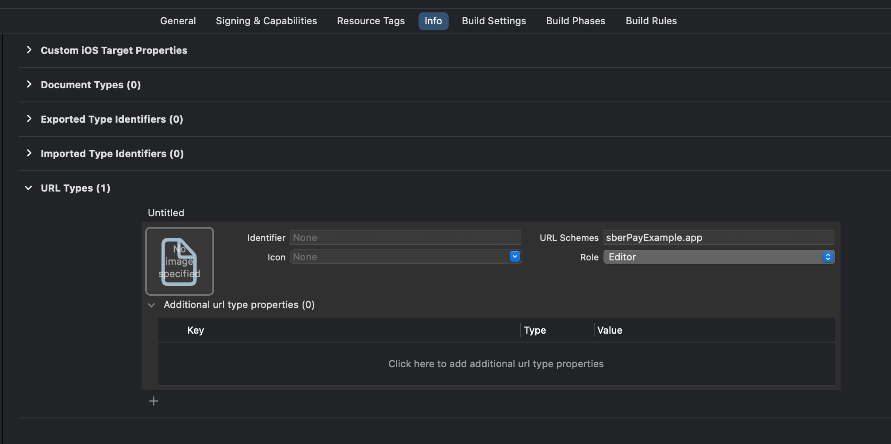

# YooKassa Payments SDK

[](https://img.shields.io/badge/Support-iOS%2014.0+-brightgreen.svg)
[](https://img.shields.io/badge/SwiftPM-Compatible-brightgreen.svg)

Библиотека позволяет встроить прием платежей в мобильные приложения на iOS и работает как дополнение к API ЮKassa.\

Общий процесс оплаты в мобильном приложении выглядит следующим образом:
1. Вы запускаете процесс [токенизации в SDK](#быстрая-интеграция);
    - пользователю отображается список возможных методов оплаты;
    - пользователь выбирает способ оплаты, вводит необходимые данные;
    - если данные введены верно и процесс токензизации завершился успешно, то SDK обменивает данные, которые ввел пользователь, на платежный токен `payment_token` и возвращает в ваше приложение этот `payment_token` ([Получить результат токенизации](#получить-результат-токенизации)).
2. Из данного платежного токена необходимо создать платеж с помощью [метода API](https://yookassa.ru/developers/api#create_payment). Таким образом, **SDK работает как дополнение к [API ЮKassa](https://yookassa.ru/developers/payments/sdk-tokens)**
3. При необходимости запускаете в SDK процесс [подтверждения платежа](#подтверждение-платежа) с помощью 3DS, SberPay или СБП.

**Диаграмма процесса токенизации и проведения платежа:**



В мобильный SDK входят готовые платежные интерфейсы (форма оплаты и всё, что с ней связано).\
С помощью SDK можно получать токены для проведения оплаты с банковской карты, Сбербанк Онлайн, СБОЛ, через СБП или из кошелька в ЮMoney.

- [Код библиотеки](https://git.yoomoney.ru/projects/SDK/repos/yookassa-payments-swift/browse)
- [Код демо-приложения, которое интегрирует библиотеку](https://git.yoomoney.ru/projects/SDK/repos/yookassa-payments-swift/browse)

---

- [YooKassa Payments SDK](#yookassa-payments-sdk)
  - [Changelog](#changelog)
  - [Migration guide](#migration-guide)
  - [Требования](#требования)
  - [Подключение зависимостей](#подключение-зависимостей)
    - [Swift Package Manager](#swift_package_manager)
    - [CocoaPods](#cocoapods)
    - [Carthage](#carthage)
  - [Быстрая интеграция](#быстрая-интеграция)
  - [Доступные способы оплаты](#доступные-способы-оплаты)
  - [Настройка способов оплаты](#настройка-способов-оплаты)
    - [ЮMoney](#юmoney)
      - [Как получить `client id` центра авторизации системы `ЮMoney`](#как-получить-client-id-центра-авторизации-системы-юmoney)
      - [Передать `client id` в параметре `moneyAuthClientId`](#передать-client-id-в-параметре-moneyauthclientid)
      - [Поддержка авторизации через мобильное приложение](#поддержка-авторизации-через-мобильное-приложение)
    - [Банковская карта](#банковская-карта)
    - [SberPay](#sberpay)
    - [СБП](#sbp)
  - [Описание публичных параметров](#описание-публичных-параметров)
    - [TokenizationFlow](#tokenizationflow)
    - [YooKassaPaymentsError](#yookassapaymentserror)
    - [TokenizationModuleInputData](#tokenizationmoduleinputdata)
    - [BankCardRepeatModuleInputData](#bankcardrepeatmoduleinputdata)
    - [TokenizationSettings](#tokenizationsettings)
    - [TestModeSettings](#testmodesettings)
    - [Amount](#amount)
    - [Currency](#currency)
    - [CustomizationSettings](#customizationsettings)
    - [SavePaymentMethod](#savepaymentmethod)
  - [Сканирование банковских карт](#сканирование-банковских-карт)
  - [Настройка подтверждения платежа](#настройка-подтверждения-платежа)
  - [Логирование](#логирование)
  - [Тестовый режим](#тестовый-режим)
  - [Запуск Example](#запуск-example)
  - [Кастомизация интерфейса](#кастомизация-интерфейса)
  - [Платёж привязанной к магазину картой с дозапросом CVC/CVV](#платёж-привязанной-к-магазину-картой-с-дозапросом-cvccvv)
  - [Лицензия](#лицензия)

## <a name="changelog"></a> Changelog

[Ссылка на Changelog](https://git.yoomoney.ru/projects/SDK/repos/yookassa-payments-swift/browse/CHANGELOG.md)

## <a name="migration-guide"></a> Migration guide

[Ссылка на Migration guide](https://git.yoomoney.ru/projects/SDK/repos/yookassa-payments-swift/browse/MIGRATION.md)

## <a name="требования"></a> Требования

- минимальная CocoaPods версия 1.13.0 и выше,
- iOS версии 14.0 и выше.

## <a name="подключение-зависимостей"></a> Подключение зависимостей

### <a name="swift_package_manager"></a> Swift Package Manager

1. Откройте диалог добавления пакета[1] и вставьте адрес репозитория[2]:
    - Xcode -> File menu -> Add Package Dependency  https://git.yoomoney.ru/scm/sdk/yookassa-payments-swift.git
    

    ИЛИ

    - Project Navigator (cmd+1) -> выбрать проект -> закладка Package Dependencies -> нажать +(Add Package Dependency) [1]
    

    в окне добавления пакета, в поисковую строку вставьте адрес https://git.yoomoney.ru/scm/sdk/yookassa-payments-swift.git [2]

2. После того как SPM проверит пакет 
   

   Добавьте зависимость к желаемому таргету[3,4]
   

### <a name="cocoapods"></a> CocoaPods

1. Установите CocoaPods версии 1.13.0 или выше.

```zsh
gem install cocoapods
```

[Официальная документация по установке CocoaPods](https://guides.cocoapods.org/using/getting-started.html#updating-cocoapods).\
[Какие версии CocoaPods есть](https://github.com/CocoaPods/CocoaPods/releases).

1. Создайте файл Podfile

> CocoaPods предоставляет команду `pod init` для создания Podfile с настройками по умолчанию.

2. Добавьте зависимости в `Podfile`.\
  [Пример](https://git.yoomoney.ru/projects/SDK/repos/yookassa-payments-swift/browse/Podfile) `Podfile` из демо-приложения.

```shell
source 'https://github.com/CocoaPods/Specs.git'
source 'https://git.yoomoney.ru/scm/sdk/cocoa-pod-specs.git'

platform :ios, '10.0'
use_frameworks!

target 'Your Target Name' do
  pod 'YooKassaPayments', :git => 'https://git.yoomoney.ru/scm/sdk/yookassa-payments-swift.git', :tag => '#TAG#'
end
```

> `Your Target Name` - название таргета в Xcode для вашего приложения.\
> `tag` - версия SDK. Актуальную версию можно узнать в нашем git репозитории в разделе [коммиты](https://git.yoomoney.ru/projects/SDK/repos/yookassa-payments-swift/commits).
   Мы рекомендуем использовать всегда использовать самую новую доступную версию нашей библиотеки.

> Если вам необходимо управлять типом линковки библиотеки используйте один из двух типов `:linkage` -> `:static` или `:dynamic`

```shell
source 'https://github.com/CocoaPods/Specs.git'
source 'https://git.yoomoney.ru/scm/sdk/cocoa-pod-specs.git'

platform :ios, '10.0'

target 'Your Target Name' do
  use_frameworks! :linkage => :dynamic
  pod 'YooKassaPayments',
    :git => 'https://git.yoomoney.ru/scm/sdk/yookassa-payments-swift.git',
    :tag => '#TAG#'
end
```

3. Выполните команду `pod install`


Решение проблем подключения:

А. В случае когда `pod install` завершается с ошибкой – попробуйте команду `pod update YooKassaPayments`

B. В некоторых сложных случаях рекомендуем сбросить кэш cocoapods. Это можно сделать несколькими способам.

   Вариант 1: выполнить набор команд для сброса кэша для пода YooKassaPayments и его зависимостей:
               ```
               pod cache clean FunctionalSwift --all
               pod cache clean MoneyAuth  --all
               pod cache clean YooMoneySessionProfiler  --all
               pod cache clean YooKassaPayments  --all
               pod cache clean YooKassaPaymentsApi  --all
               pod cache clean YooKassaWalletApi  --all
               pod cache clean YooMoneyCoreApi  --all
               ``` 
   Вариант 2: Удалить полностью кэш cocoapods командой `rm -rf ~/.cocoapods/repos`. Обращаем ваше внимание что после этого
              cocoapods будет восстанавливать свой локальный каталог некоторое время.

   Далее рекомендуем выполнить `pod deintegrate YOUR_PROJECT_NAME.xcodeproj` 
   для последущей чистой установки командой `pod install` 

### <a name="carthage"></a> Carthage

На текущий мы не можем гарантировать что установка посредствам Carthage пройдёт без проблем.

Для того чтобы попробовать вариант установки через Carthage, добавьте в ваш Cartfile следущее
`git "https://git.yoomoney.ru/scm/sdk/cocoa-pod-specs.git"

можно указать версию
`git "https://git.yoomoney.ru/scm/sdk/cocoa-pod-specs.git" == VERSION_NUMBER`
где `VERSION_NUMBER` одна из версий библиотеки, например `6.7.0`. 
Узнать доступные версии можно в истории коммитов нашего репозитория.


Чтобы локально собрать `YooKassaPayments.xcframework`, надо склонировать репозиторий в локальную директорию и 
выполнить в этой директории следущую команду: 
`carthage build --platform iOS --use-xcframeworks --no-skip-current`

## <a name="быстрая-интеграция"></a> Быстрая интеграция

1. Создайте `TokenizationModuleInputData` (понадобится [ключ для клиентских приложений](https://yookassa.ru/my/tunes) из личного кабинета ЮKassa). В этой модели передаются параметры платежа (валюта и сумма) и параметры платежной формы, которые увидит пользователь при оплате (способы оплаты, название магазина и описание заказа).

> Для работы с сущностями YooKassaPayments импортируйте зависимости в исходный файл

```swift
import YooKassaPayments
```

Пример создания `TokenizationModuleInputData`:

```swift
let clientApplicationKey = "<Ключ для клиентских приложений>"
let amount = Amount(value: 999.99, currency: .rub)
let tokenizationModuleInputData =
          TokenizationModuleInputData(clientApplicationKey: clientApplicationKey,
                                      shopName: "Космические объекты",
                                      shopId: "654321",
                                      purchaseDescription: """
                                                            Комета повышенной яркости, период обращения — 112 лет
                                                            """,
                                      amount: amount,
                                      savePaymentMethod: .on)
```

2. Создайте `TokenizationFlow` с кейсом `.tokenization` и передайте `TokenizationModuleInputData`.

Пример создания `TokenizationFlow`:

```swift
let inputData: TokenizationFlow = .tokenization(tokenizationModuleInputData)
```

3. Создайте `ViewController` из `TokenizationAssembly` и выведите его на экран.

```swift
let viewController = TokenizationAssembly.makeModule(inputData: inputData,
                                                       moduleOutput: self)
present(viewController, animated: true, completion: nil)
```
TokenizationAssembly возвращает тип UIViewController. Чтобы показать его в SwiftUI нужно использовать [UIViewControllerRepresentable](https://developer.apple.com/documentation/swiftui/uiviewcontrollerrepresentable).

В `moduleOutput` необходимо передать объект, который реализует протокол `TokenizationModuleOutput`.

4. Реализуйте протокол `TokenizationModuleOutput`.

```swift
extension ViewController: TokenizationModuleOutput {
    func tokenizationModule(
        _ module: TokenizationModuleInput,
        didTokenize token: Tokens,
        paymentMethodType: PaymentMethodType
    ) {
        DispatchQueue.main.async { [weak self] in
            guard let self = self else { return }
            self.dismiss(animated: true)
        }
        // Отправьте токен в вашу систему
    }

    func didFinish(
        on module: TokenizationModuleInput,
        with error: YooKassaPaymentsError?
    ) {
        DispatchQueue.main.async { [weak self] in
            guard let self = self else { return }
            self.dismiss(animated: true)
        }
    }

    func didFinishConfirmation(
        paymentMethodType: PaymentMethodType
    ) {
        DispatchQueue.main.async { [weak self] in
            guard let self = self else { return }

            // Создать экран успеха после прохождения подтверждения (3DS или Sberpay)
            self.dismiss(animated: true)
            // Показать экран успеха
        }
    }
    
    func didFailConfirmation(error: YooKassaPaymentsError?) {
        DispatchQueue.main.async { [weak self] in
            guard let self = self else { return }
            
            // Показать экран с ошибкой подтверждения
        }
    }
}
```

Закройте модуль SDK и отправьте токен в вашу систему. Затем [создайте платеж](https://yookassa.ru/developers/api#create_payment) по API ЮKassa, в параметре `payment_token` передайте токен, полученный в SDK. Способ подтверждения при создании платежа зависит от способа оплаты, который выбрал пользователь. Он приходит вместе с токеном в `paymentMethodType`.

## <a name="доступные-способы-оплаты"></a> Доступные способы оплаты

Сейчас в SDK для iOS доступны следующие способы оплаты:

`.yooMoney` — ЮMoney (платежи из кошелька или привязанной картой)\
`.bankCard` — банковская карта (карты можно сканировать)\
`.sberbank` — SberPay (с подтверждением через актуальное приложение Сбербанк Онлайн)\
`.sbp` - СБП

## <a name="настройка-способов-оплаты"></a> Настройка способов оплаты

У вас есть возможность сконфигурировать способы оплаты.\
Для этого необходимо при создании `TokenizationModuleInputData` в параметре `tokenizationSettings` передать модель типа `TokenizationSettings`.

> Для некоторых способов оплаты нужна дополнительная настройка (см. ниже).\
> По умолчанию используются все доступные способы оплаты.

```swift
// Создайте пустой OptionSet PaymentMethodTypes
var paymentMethodTypes: PaymentMethodTypes = []

if <Условие для банковской карты> {
    // Добавляем в paymentMethodTypes элемент `.bankCard`
    paymentMethodTypes.insert(.bankCard)
}

if <Условие для Сбербанка Онлайн> {
    // Добавляем в paymentMethodTypes элемент `.sberbank`
    paymentMethodTypes.insert(.sberbank)
}

if <Условие для ЮMoney> {
    // Добавляем в paymentMethodTypes элемент `.yooMoney`
    paymentMethodTypes.insert(.yooMoney)
}

if <Условие для СБП> {
    // Добавляем в paymentMethodTypes элемент `.sbp`
    paymentMethodTypes.insert(.sbp)
}

let tokenizationSettings = TokenizationSettings(paymentMethodTypes: paymentMethodTypes)
```

Теперь используйте `tokenizationSettings` при инициализации `TokenizationModuleInputData`.

### <a name="юmoney"></a> ЮMoney

Для подключения способа оплаты `ЮMoney` необходимо:

1. Получить `client id` центра авторизации системы `ЮMoney`.
2. При создании `TokenizationModuleInputData` передать `client id` в параметре `moneyAuthClientId`

#### <a name="как-получить-client-id-центра-авторизации-системы-юmoney"></a> Как получить `client id` центра авторизации системы `ЮMoney`

1. Авторизуйтесь на [yookassa.ru](https://yookassa.ru)
2. Перейти на страницу регистрации клиентов СЦА - [yookassa.ru/oauth/v2/client](https://yookassa.ru/oauth/v2/client)
3. Нажать [Зарегистрировать](https://yookassa.ru/oauth/v2/client/create)
4. Заполнить поля:\
4.1. "Название" - `required` поле, отображается при выдаче прав и в списке приложений.\
4.2. "Описание" - `optional` поле, отображается у пользователя в списке приложений.\
4.3. "Ссылка на сайт приложения" - `optional` поле, отображается у пользователя в списке приложений.\
4.4. "Код подтверждения" - выбрать `Передавать в Callback URL`, можно указывать любое значение, например ссылку на сайт.
5. Выбрать доступы:\
5.1. `Кошелёк ЮMoney` -> `Просмотр`\
5.2. `Профиль ЮMoney` -> `Просмотр`
6. Нажать `Зарегистрировать`

#### <a name="передать-client-id-в-параметре-moneyauthclientid"></a> Передать `client id` в параметре `moneyAuthClientId`

При создании `TokenizationModuleInputData` передать `client id` в параметре `moneyAuthClientId`

```swift
let moduleData = TokenizationModuleInputData(
    ...
    moneyAuthClientId: "client_id")
```

Чтобы провести платеж:

1. При создании `TokenizationModuleInputData` передайте значение `.yooMoney` в `paymentMethodTypes.`
2. Получите токен.
3. [Создайте платеж](https://yookassa.ru/developers/api#create_payment) с токеном по API ЮKassa.

#### <a name="поддержка-авторизации-через-мобильное-приложение"></a> Поддержка авторизации через мобильное приложение

1. В `TokenizationModuleInputData` необходимо передавать `applicationScheme` – схема для возврата в приложение после успешной авторизации в `ЮMoney` через мобильное приложение.

Пример `applicationScheme`:

```swift
let moduleData = TokenizationModuleInputData(
    ...
    applicationScheme: "examplescheme://"
```

2. В `AppDelegate` импортировать зависимость `YooKassaPayments`:

   ```swift
   import YooKassaPayments
   ```

3. Добавить обработку ссылок через `YKSdk` в `AppDelegate`:

```swift
func application(
    _ application: UIApplication,
    open url: URL,
    sourceApplication: String?, 
    annotation: Any
) -> Bool {
    return YKSdk.shared.handleOpen(
        url: url,
        sourceApplication: sourceApplication
    )
}
```

4. В `Info.plist` добавьте следующие строки:

```plistbase
<key>LSApplicationQueriesSchemes</key>
<array>
	<string>yoomoneyauth</string>
</array>
<key>CFBundleURLTypes</key>
<array>
	<dict>
		<key>CFBundleTypeRole</key>
		<string>Editor</string>
		<key>CFBundleURLName</key>
		<string>${BUNDLE_ID}</string>
		<key>CFBundleURLSchemes</key>
		<array>
			<string>examplescheme</string>
		</array>
	</dict>
</array>
```

где `examplescheme` - схема для открытия вашего приложения, которую вы указали в `applicationScheme` при создании `TokenizationModuleInputData`. Через эту схему будет открываться ваше приложение после успешной авторизации в `ЮMoney` через мобильное приложение.

### <a name="банковская-карта"></a> Банковская карта

1. При создании `TokenizationModuleInputData` передайте значение `.bankcard` в `paymentMethodTypes`.
2. Получите токен.
3. [Создайте платеж](https://yookassa.ru/developers/api#create_payment) с токеном по API ЮKassa.

### <a name="sberpay"></a> SberPay

С помощью SDK можно провести и подтвердить платеж через актуальное приложение Сбера, если оно установленно.

#### Обратите внимание
Для работы SberPay требуется уникальная URL-scheme зарегистрированная в системе Сбера. Запросите такую схему у нашего менеджера поддержки по адресу b2b_support@yoomoney.ru.

Полученную от поддержки схему нужно зарегистрировать в файле вашего проекта, как показано ниже:


А также передайте ее в `TokenizationModuleInputData` в параметре `applicationScheme`.

```swift
let moduleData = TokenizationModuleInputData(
    ...
    applicationScheme: "sdkvzcyfyexmpl://"
```

Чтобы провести платёж:

1. При создании `TokenizationModuleInputData` передайте значение `.sberbank` в `paymentMethodTypes`.
2. Получите токен.
3. [Создайте платеж](https://yookassa.ru/developers/api#create_payment) с токеном по API ЮKassa.

Для подтверждения платежа через приложение Сбербанка:

1. В `AppDelegate` импортируйте зависимость `YooKassaPayments`:

   ```swift
   import YooKassaPayments
   ```

2. Добавьте обработку ссылок через `YKSdk` в `AppDelegate`:

```swift
func application(
    _ application: UIApplication,
    open url: URL,
    sourceApplication: String?,
    annotation: Any
) -> Bool {
    return YKSdk.shared.handleOpen(
        url: url,
        sourceApplication: sourceApplication
    )
}
```

3. В `Info.plist` добавьте следующие строки:

```plistbase
<key>CFBundleURLTypes</key>
<array>
    <dict>
        <key>CFBundleTypeRole</key>
        <string>Editor</string>
        <key>CFBundleURLName</key>
        <string>${BUNDLE_ID}</string>
        <key>CFBundleURLSchemes</key>
        <array>
            <string>examplescheme</string>
        </array>
    </dict>
</array>
```

где `examplescheme` - схема для открытия вашего приложения, которую вы указали в `applicationScheme` при создании `TokenizationModuleInputData`. Через эту схему будет открываться ваше приложение после успешной оплаты с помощью `SberPay`.

4. Добавить в `Info.plist` новые схемы для обращения в сервисам Сбера

```
<key>DTXAutoStart</key>
<string>false</string>
<key>LSApplicationQueriesSchemes</key>
<array>
    <string>sbolidexternallogin</string>
    <string>sberbankidexternallogin</string>   
</array>
```

и расширенные настройки для http-соединений к сервисам Сбера

```
<key>NSAppTransportSecurity</key>
<dict>
    <key>NSExceptionDomains</key>
    <dict>
    <key>gate1.spaymentsplus.ru</key>
    <dict>
       <key>NSExceptionAllowsInsecureHTTPLoads</key>
       <true/>
    </dict>
    <key>ift.gate2.spaymentsplus.ru</key>
    <dict>
       <key>NSExceptionAllowsInsecureHTTPLoads</key>
       <true/>
    </dict>
    <key>cms-res.online.sberbank.ru</key>
       <dict>
           <key>NSExceptionAllowsInsecureHTTPLoads</key>
           <true/>
       </dict>
    </dict>
</dict>
```

также, возникает требование расширить доступ приложения к данным пользователя для обеспечения безопасности проведения платежей

```
<key>NSFaceIDUsageDescription</key>
<string>Так вы подтвердите, что именно вы выполняете вход</string>
<key>NSLocationWhenInUseUsageDescription</key>
<string>Данные о местонахождении собираются и отправляются на сервер для безопасного проведения оплаты</string>
```

5. Реализуйте метод `didFinishConfirmation(paymentMethodType:)` протокола `TokenizationModuleOutput`, который будет вызыван, когда процесс подтверждения будет пройден или пропущен пользователем. На следующем шаге для проверки статуса платежа (прошел ли пользователь подтверждение успешно или нет) используйте [YooKassa API](https://yookassa.ru/developers/api#get_payment)
(см. [Настройка подтверждения платежа](#настройка-подтверждения-платежа)).

### <a name="sbp"></a> CБП

С помощью SDK можно провести платеж через СБП — с подтверждением оплаты через приложение банка.

Подтверждение платежа через СБП происходит в приложении банка. Предполагается, что пользователь после подтверждения самостоятельно возвращается в ваше приложения для просмотра статуса оплаты. 

Чтобы провести платёж:

1. При создании `TokenizationModuleInputData` передайте значение `.sbp` в `paymentMethodTypes`.
2. Получите токен.
3. [Создайте платеж](https://yookassa.ru/developers/api#create_payment) с токеном по API ЮKassa.

Для настройки подтверждения через приложение банка:

1. В `Info.plist` добавьте следующие строки:

```plistbase
<key>CFBundleURLTypes</key>
<array>
    <dict>
        <key>CFBundleTypeRole</key>
        <string>Editor</string>
        <key>CFBundleURLName</key>
        <string>${BUNDLE_ID}</string>
        <key>CFBundleURLSchemes</key>
        <array>
            <string>examplescheme</string>
        </array>
    </dict>
</array>
```

2. В `Info.plist` перечислить url-схемы приложений популярных банков

SDK пользователю отображается список банков, поддерживающих оплату `СБП`. При выборе конкретного банка из списка произойдет переход в соответствующее банковское приложение.
Список банков в SDK сформирован на основе ответа [НСПК](https://qr.nspk.ru/proxyapp/c2bmembers.json). Он содержит более тысячи банков, и для удобства SDK в первую очередь отображает список популярных банков, которые чаще всего используют для оплаты. Для проверки факта установки приложения на телефоне мы используем системную функцию [canOpenURL(:)](https://developer.apple.com/documentation/uikit/uiapplication/1622952-canopenurl). Данная функция возвращает корректный ответ только для схем добавленных в `Info.plist` с ключом `LSApplicationQueriesSchemes`.
Поэтому для корректного отображения списка популярных банков вам необходимо внести в `Info.plist` их url-схемы:

```plistbase
<key>LSApplicationQueriesSchemes</key>
<array>
    <string>bank100000000111</string> // Сбербанк
    <string>bank100000000004</string> // Тинькофф
    <string>bank110000000005</string> // ВТБ
    <string>bank100000000008</string> // Альфа
    <string>bank100000000007</string> // Райфайзен
    <string>bank100000000015</string> // Открытие
</array>
```

Если список не добавлять в `Info.plist`, SDK сразу отобразит полный список банков поддерживающих оплату `СБП`.

3. Импортируйте зависимость `YooKassaPayments`:

   ```swift
   import YooKassaPayments
   ```

4. Для подтверждения платежа при оплате через СБП необходимо запустить сценарий подтверждения:

```swift
self.tokenizationViewController.startConfirmationProcess(
    confirmationUrl: confirmationUrl,
    paymentMethodType: .sbp
)
```
`confirmationUrl` вы получите в ответе от API ЮKassa при [создании платежа](https://yookassa.ru/developers/api#create_payment); он имеет вид   "https://qr.nspk.ru/id?type=&bank=&sum=&cur=&crc=&payment_id="

5. После того, как плательщик пройдет процесс подтверждения платежа (или пропустит его) в приложении банка и вернется ваше приложение, будет вызван метод:

```swift
func didFinishConfirmation(paymentMethodType: PaymentMethodType) {
    DispatchQueue.main.async { [weak self] in
        guard let self = self else { return }

        // Now close tokenization module
        self.dismiss(animated: true)
    }
}
```

6. Так как вызов `didFinishConfirmation` не гарантирует прохождения плательщиком подтверждения платежа в приложении банка (он может его и пропустить), на следующем шаге для проверки статуса платежа (прошел ли пользователь подтверждение успешно или нет) используйте [YooKassa API](https://yookassa.ru/developers/api#get_payment)

7. (Опционально) В случае, если схема вашего приложения добавлена в лист `LSApplicationQueriesSchemes` в приложении банка, тогда банк сможет ее использовать для возврата плательщика в ваше приложение после завершения подтверждения платежа.
Для поддержки сценария возврата по url-scheme:

- передайте в `TokenizationModuleInputData` url-scheme `applicationScheme`:

```swift
let moduleData = TokenizationModuleInputData(
    ...
    applicationScheme: "examplescheme://"
```

и добавьте обработку ссылок через `YKSdk` в `AppDelegate`:

```swift
func application(
    _ application: UIApplication,
    open url: URL,
    sourceApplication: String?, 
    annotation: Any
) -> Bool {
    return YKSdk.shared.handleOpen(
        url: url,
        sourceApplication: sourceApplication
    )
}
```

## <a name="описание-публичных-параметров"></a> Описание публичных параметров

### <a name="tokenizationflow"></a> TokenizationFlow

`Enum`, который определяет логику работы SDK.

| Case           | Тип              | Описание |
| -------------- | ---------------- | -------- |
| tokenization   | TokenizationFlow | Принимает на вход модель `TokenizationModuleInputData`. Логика для токенизации несколько способов оплаты на выбор: Банковская карта, ЮMoney, Сбербанк-Онлайн |
| bankCardRepeat | TokenizationFlow | Принимает на вход модель `BankCardRepeatModuleInputData`. Логика для токенизации сохраненных способов оплаты по идентификатору способа оплаты |

### <a name="yookassapaymentserror"></a> YooKassaPaymentsError

`Enum` с возможными ошибками, которые можно обработать в методе `func didFinish(on module:, with error:)`

| Case                  | Тип   | Описание |
| --------------------- | ----- | -------- |
| paymentMethodNotFound | Error | По paymentMethodId не было найдено ни одного сохраненного способа оплаты. |
| paymentConfirmation   | Error | Ошибка при подтверждении платежа. |

### <a name="tokenizationmoduleinputdata"></a> TokenizationModuleInputData

>Обязательные:

| Параметр             | Тип    | Описание |
| -------------------- | ------ | -------- |
| clientApplicationKey | String            | Ключ для клиентских приложений из личного кабинета ЮKassa ([раздел Настройки|https://yookassa.ru/my/api-keys-settings] — Ключи API); |
| shopName             | String            | Название магазина в форме оплаты |
| shopId               | String            | Идентификатор магазина в ЮKassa ([раздел Организации|https://yookassa.ru/my/company/organization] - скопировать shopId у нужного магазина); |
| purchaseDescription  | String            | Описание заказа в форме оплаты |
| amount               | Amount            | Объект, содержащий сумму заказа и валюту |
| savePaymentMethod    | SavePaymentMethod | Настройка сохранения платёжного метода. Сохранённые платёжные методы можно использовать для проведения рекуррентных платежей, (см. [Рекуррентные платежи|#платёж-привязанной-к-магазину-картой-с-дозапросом-cvccvv]). |

>Необязательные:

| Параметр                   | Тип                   | Описание                                                     |
| -------------------------- | --------------------- | ------------------------------------------------------------ |
| gatewayId                  | String                | По умолчанию `nil`. Используется, если у вас несколько платежных шлюзов с разными идентификаторами. |
| tokenizationSettings       | TokenizationSettings  | По умолчанию используется стандартный инициализатор со всеми способами оплаты. Параметр отвечает за настройку токенизации (способы оплаты и логотип ЮKassa). |
| testModeSettings           | TestModeSettings      | По умолчанию `nil`. Настройки тестового режима.              |
| cardScanning               | CardScanning          | По умолчанию `nil`. Возможность сканировать банковские карты. |
| returnUrl                  | String                | По умолчанию `nil`. URL страницы (поддерживается только `https`), на которую надо вернуться после прохождения 3-D Secure. Необходим только при кастомной реализации 3-D Secure. Если вы используете `startConfirmationProcess(confirmationUrl:paymentMethodType:)`, не задавайте этот параметр. |
| isLoggingEnabled           | Bool                  | По умолчанию `false`. Включает логирование сетевых запросов. |
| userPhoneNumber            | String                | По умолчанию `nil`. Телефонный номер пользователя в формате 7XXXXXXXXXX.           |
| customizationSettings      | CustomizationSettings | По умолчанию используется цвет blueRibbon. Цвет основных элементов, кнопки, переключатели, поля ввода. |
| moneyAuthClientId          | String                | По умолчанию `nil`. Идентификатор для центра авторизации в системе YooMoney. |
| applicationScheme          | String                | По умолчанию `nil`. Схема для возврата в приложение после успешной оплаты с помощью `Sberpay` в приложении СберБанк Онлайн или после успешной авторизации в `YooMoney` через мобильное приложение. |
| customerId                      | String                 | По умолчанию `nil`. Уникальный идентификатор покупателя в вашей системе, например электронная почта или номер телефона. Не более 200 символов. Используется, если вы хотите запомнить банковскую карту и отобразить ее при повторном платеже в mSdk. Убедитесь, что customerId относится к пользователю, который хочет совершить покупку. Например, используйте двухфакторную аутентификацию. Если передать неверный идентификатор, пользователь сможет выбрать для оплаты чужие банковские карты.|
### <a name="bankcardrepeatmoduleinputdata"></a> BankCardRepeatModuleInputData

>Обязательные:

| Параметр             | Тип    | Описание |
| -------------------- | ------ | -------- |
| clientApplicationKey | String | Ключ для клиентских приложений из личного кабинета ЮKassa ([раздел Настройки — Ключи API](https://yookassa.ru/my/api-keys-settings)) |
| shopName             | String | Название магазина в форме оплаты |
| purchaseDescription  | String | Описание заказа в форме оплаты |
| paymentMethodId      | String | Идентификатор сохраненного способа оплаты |
| amount               | Amount | Объект, содержащий сумму заказа и валюту |
| savePaymentMethod    | SavePaymentMethod | Настройка сохранения платёжного метода. Сохранённые платёжные методы можно использовать для проведения рекуррентных платежей, (см. [Рекуррентные платежи|#платёж-привязанной-к-магазину-картой-с-дозапросом-cvccvv]). |

>Необязательные:

| Параметр              | Тип                   | Описание                                                     |
| --------------------- | --------------------- | ------------------------------------------------------------ |
| testModeSettings      | TestModeSettings      | По умолчанию `nil`. Настройки тестового режима.              |
| returnUrl             | String                | По умолчанию `nil`. URL страницы (поддерживается только `https`), на которую надо вернуться после прохождения 3-D Secure. Необходим только при кастомной реализации 3-D Secure. Если вы используете `startConfirmationProcess(confirmationUrl:paymentMethodType:)`, не задавайте этот параметр. |
| isLoggingEnabled      | Bool                  | По умолчанию `false`. Включает логирование сетевых запросов. |
| customizationSettings | CustomizationSettings | По умолчанию используется цвет blueRibbon. Цвет основных элементов, кнопки, переключатели, поля ввода. |
| gatewayId             | String                | По умолчанию `nil`. Используется, если у вас несколько платежных шлюзов с разными идентификаторами. |

### <a name="tokenizationsettings"></a> TokenizationSettings

Можно настроить список способов оплаты и отображение логотипа ЮKassa в приложении.

| Параметр               | Тип                | Описание |
| ---------------------- | ------------------ | -------- |
| paymentMethodTypes     | PaymentMethodTypes | По умолчанию `.all`. [Способы оплаты](#настройка-способов-оплаты), доступные пользователю в приложении. |

### <a name="testmodesettings"></a> TestModeSettings

| Параметр                   | Тип    | Описание |
| -------------------------- | ------ | -------- |
| paymentAuthorizationPassed | Bool   | Определяет, пройдена ли платежная авторизация при оплате ЮMoney. |
| cardsCount                 | Int    | Количество привязанные карт к кошельку в ЮMoney. |
| charge                     | Amount | Сумма и валюта платежа. |
| enablePaymentError         | Bool   | Определяет, будет ли платеж завершен с ошибкой. |

### <a name="amount"></a> Amount

| Параметр | Тип      | Описание |
| -------- | -------- | -------- |
| value    | Decimal  | Сумма платежа |
| currency | Currency | Валюта платежа |

### <a name="currency"></a> Currency

| Параметр | Тип      | Описание |
| -------- | -------- | -------- |
| rub      | String   | ₽ - Российский рубль |
| usd      | String   | $ - Американский доллар |
| eur      | String   | € - Евро |
| custom   | String   | Будет отображаться значение, которое передали |

### <a name="customizationsettings"></a> CustomizationSettings

| Параметр   | Тип     | Описание |
| ---------- | ------- | -------- |
| mainScheme | UIColor | По умолчанию используется цвет blueRibbon. Цвет основных элементов, кнопки, переключатели, поля ввода. |
| showYooKassaLogo       | Bool               | По умолчанию `true`. Отвечает за отображение логотипа ЮKassa. По умолчанию логотип отображается. |

### <a name="savepaymentmethod"></a> SavePaymentMethod

| Параметр    | Тип               | Описание |
| ----------- | ----------------- | -------- |
| on          | SavePaymentMethod | Сохранить платёжный метод для проведения рекуррентных платежей. Пользователю будут доступны только способы оплаты, поддерживающие сохранение. На экране контракта будет отображено сообщение о том, что платёжный метод будет сохранён. |
| off         | SavePaymentMethod | Не дает пользователю выбрать, сохранять способ оплаты или нет. |
| userSelects | SavePaymentMethod | Пользователь выбирает, сохранять платёжный метод или нет. Если метод можно сохранить, на экране контракта появится переключатель. |

## <a name="сканирование-банковских-карт"></a> Сканирование банковских карт

Если хотите, чтобы пользователи смогли сканировать банковские карты при оплате, необходимо:

1. Создать сущность и реализовать протокол `CardScanning`.
На примере YooMoneyVision:

```swift
class CardScannerProvider: CardScanning {
    weak var cardScanningDelegate: CardScanningDelegate?

    var cardScanningViewController: UIViewController? {
        let inputData = BankCardScannerModuleInputData(
            numberRecognitionPriority: .required,
            expirationDateRecognitionPriority: .required,
            securityCodeRecognitionPriority: .needless
        )
        return BankCardScannerAssembly.makeModule(
            inputData: inputData,
            moduleOutput: self
        ).viewController
    }
}
```

2. Настроить получение данных из вашего инструмента для сканирования банковской карты.\
На примере YooMoneyVision:

```swift
extension CardScannerProvider: BankCardScannerModuleOutput {
    public func bankCardScannerModuleDidRecognize(
        _ module: BankCardScannerModuleInput,
        number: String?,
        expirationDate: (month: String, year: String)?,
        securityCode: String?
    ) {
        DispatchQueue.main.async { [weak self] in
            let scannedCardInfo = ScannedCardInfo(
                number: number,
                expiryMonth: "\(expirationDate?.month ?? "")",
                expiryYear: "\(expirationDate?.year ?? "")"
            )
            self?.cardScanningDelegate?.cardScannerDidFinish(scannedCardInfo)
        }
    }
}
```

3. Передать экземпляр объекта `CardScannerProvider` в `TokenizationModuleInputData` в параметр `cardScanning:`.

```swift
let inputData = TokenizationModuleInputData(
    ...
    cardScanning: CardScannerProvider())
```

Реализовать предупреждение об отсутствии доступа к камере вам необходимо самомстоятельно.
Например, в подключаемом вами модуле сканирования карт, или возвращая UIViewController с предупреждением в переменной cardScanningViewController.

## <a name="настройка-подтверждения-платежа"></a> Настройка подтверждения платежа

Если вы хотите использовать нашу реализацию подтверждения платежа, не закрывайте модуль SDK после получения токена.\
Отправьте токен на ваш сервер и после успешной оплаты закройте модуль.\
Если ваш сервер сообщил о необходимости подтверждения платежа (т.е. платёж пришёл со статусом `pending`), вызовите метод `startConfirmationProcess(confirmationUrl:paymentMethodType:)`.

После того, как пользователь пройдет процесс подтверждения платежа или пропустит его, будет вызван метод `didFinishConfirmation(paymentMethodType:)` протокола `TokenizationModuleOutput`.

Примеры кода:

1. Сохраните tokenization модуль.

```swift
self.tokenizationViewController = TokenizationAssembly.makeModule(...)
```

2. Не закрывайте tokenization модуль после получения токена.

```swift
func tokenizationModule(_ module: TokenizationModuleInput,
                        didTokenize token: Tokens,
                        paymentMethodType: PaymentMethodType) {
    // Отправьте токен на ваш сервер.
}
```

3. Вызовите подтверждение платежа, если это необходимо.

```swift
self.tokenizationViewController.startConfirmationProcess(
    confirmationUrl: confirmationUrl,
    paymentMethodType: paymentMethodType
)
```

4. После того, как пользователь пройдет процесс подтверждения платежа или пропустит его будет вызван метод.

```swift
func didFinishConfirmation(paymentMethodType: PaymentMethodType) {
    DispatchQueue.main.async { [weak self] in
        guard let self = self else { return }

        // Now close tokenization module
        self.dismiss(animated: true)
    }
}
```

5. Веб-сервисы части российских банков, в частности Сбер, через которые происходит подтверждение платежа теперь подписаны SSL сертификатами, выпущенными Минцифрой. Их поддержка добавлена в mSDK с версии 6.11.0.
Вам остается только расширить настройки сетевого соединения App Transport Security Settings в основном файле Info.plist проекта.

```
<key>NSAppTransportSecurity</key>
<dict>
    <key>NSAllowsArbitraryLoads</key>
    <true/>
</dict>
```

## <a name="логирование"></a> Логирование

У вас есть возможность включить логирование всех сетевых запросов.\
Для этого необходимо при создании `TokenizationModuleInputData` передать `isLoggingEnabled: true`

```swift
let moduleData = TokenizationModuleInputData(
    ...
    isLoggingEnabled: true)
```

## <a name="тестовый-режим"></a> Тестовый режим

У вас есть возможность запустить мобильный SDK в тестовом режиме.\
Тестовый режим не выполняет никаких сетевых запросов и имитирует ответ от сервера.

Если вы хотите запустить SDK в тестовом режиме, необходимо:

1. Сконфигурировать объект с типом `TestModeSettings`.

```swift
let testModeSettings = TestModeSettings(paymentAuthorizationPassed: false,
                                        cardsCount: 2,
                                        charge: Amount(value: 999, currency: .rub),
                                        enablePaymentError: false)
```

2. Передать его в `TokenizationModuleInputData` в параметре `testModeSettings:`

```swift
let moduleData = TokenizationModuleInputData(
    ...
    testModeSettings: testModeSettings)
```

## <a name="запуск-example"></a> Запуск Example

Чтобы запустить Example приложение, необходимо:

1. Сделать `git clone` репозитория.

```shell
git clone https://git.yoomoney.ru/scm/sdk/yookassa-payments-swift.git
```
2. В консоли перейти в папку с проектом и выполнить следующие команды:

```shell
gem install bundler
bundle
pod install
```

4. Открыть `YooKassaPayments.xcworkspace`.
5. Выбрать и запустить схему `YooKassaPaymentsDemoApp`.

## <a name="кастомизация-интерфейса"></a> Кастомизация интерфейса

По умолчанию используется цвет blueRibbon. Цвет основных элементов, кнопки, переключатели, поля ввода.

1. Сконфигурировать объект `CustomizationSettings` и передать его в параметр `customizationSettings` объекта `TokenizationModuleInputData`.

```swift
let moduleData = TokenizationModuleInputData(
    ...
    customizationSettings: CustomizationSettings(mainScheme: /* UIColor */ ))
```

## <a name="платёж-привязанной-к-магазину-картой-с-дозапросом-cvccvv"></a> Платёж привязанной к магазину картой с дозапросом CVC/CVV

1. Создайте `BankCardRepeatModuleInputData`.

```swift
let bankCardRepeatModuleInputData = BankCardRepeatModuleInputData(
            clientApplicationKey: oauthToken,
            shopName: translate(Localized.name),
            purchaseDescription: translate(Localized.description),
            paymentMethodId: "24e4eca6-000f-5000-9000-10a7bb3cfdb2",
            amount: amount,
            testModeSettings: testSettings,
            isLoggingEnabled: true,
            customizationSettings: CustomizationSettings(mainScheme: .blueRibbon)
        )
```

2. Создайте `TokenizationFlow` с кейсом `.bankCardRepeat` и передайте `BankCardRepeatModuleInputData`.

```swift
let inputData: TokenizationFlow = .bankCardRepeat(bankCardRepeatModuleInputData)
```

3. Создайте `ViewController` из `TokenizationAssembly` и выведите его на экран.

```swift
let viewController = TokenizationAssembly.makeModule(
    inputData: inputData,
    moduleOutput: self
)
present(viewController, animated: true, completion: nil)
```

## <a name="лицензия"></a> Лицензия

YooKassa Payments SDK доступна под лицензией MIT. Смотрите [LICENSE](https://git.yoomoney.ru/projects/SDK/repos/yookassa-payments-swift/browse/LICENSE) файл для получения дополнительной информации.
