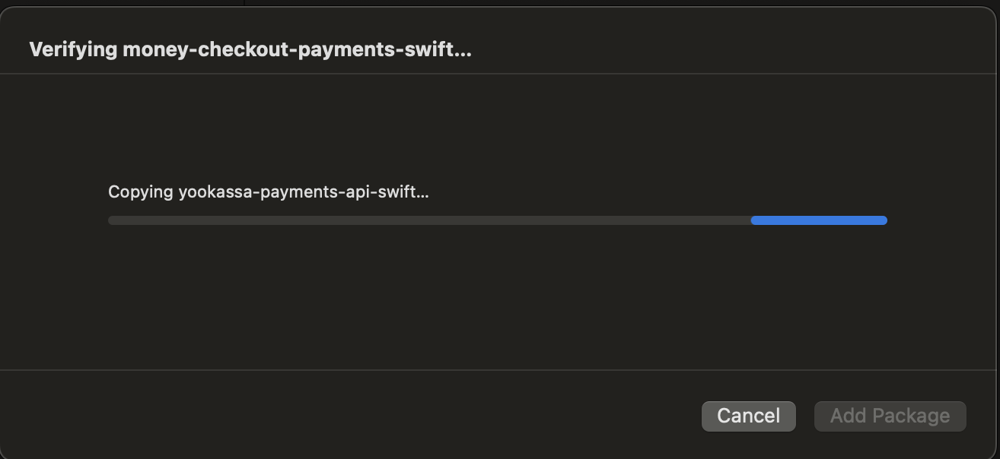

# YooMoney for Business Payments SDK (YooKassaPayments)

[](https://img.shields.io/badge/Support-iOS%2014.0+-brightgreen.svg)
[](https://img.shields.io/badge/SwiftPM-Compatible-brightgreen.svg)

This library allows implementing payment acceptance into mobile apps on iOS and works as an extension to the YooMoney API.\

The general payment process in the app is as follows:
- You start the process of [tokenization in the SDK](#tokenization);
- The user selects the payment method and enters the required data;
- The SDK exchanges this data for a payment token (`payment_token`) and returns it to you;
- After you receive `payment_token`, create a payment using the [API method](https://yookassa.ru/developers/api#create_payment);
- If necessary, launch the [payment confirmation](#payment-confirmation) process in the SDK using 3DS or SberPay.

**Tokenization and payment processes diagram:**


The mobile SDK contains ready-made payment interfaces (the payment form and everything related to it).\
Using the SDK, you can receive tokens for processing payments via bank cards, Sberbank Online, or YooMoney wallets.

- [Library code](https://git.yoomoney.ru/projects/SDK/repos/yookassa-payments-swift/browse)
- [Code of the demo app which integrates the SDK](https://git.yoomoney.ru/projects/SDK/repos/yookassa-payments-swift/browse)

---

- [YooMoney for Business Payments SDK (YooKassaPayments)](#yookassa-payments-sdk-yookassapayments)
  - [Changelog](#changelog)
  - [Migration guide](#migration-guide)
  - [Requirements](#requirements)
  - [Adding dependencies](#adding-dependencies)
    - [Swift Package Manager](#swift_package_manager)
    - [CocoaPods](#cocoapods)
    - [Carthage](#carthage)
  - [Quick integration](#quick-integration)
  - [Available payment methods](#available-payment-methods)
  - [Setting up payment methods](#setting-up-payment-methods)
    - [YooMoney](#yoomoney)
      - [How to get `client id` of the YooMoney authorization center](#how-to-get-client-id-of-the-yoomoney-authorization-center)
      - [Entering `client id` in the `moneyAuthClientId` parameter](#entering-client-id-in-the-moneyauthclientid-parameter)
      - [Support of authorization via the mobile app](#support-of-the-authorization-via-the-mobile-app)
    - [Bank cards](#bank-cards)
    - [SberPay](#sberpay)
    - [SBP](#sbp)
  - [Description of public parameters](#description-of-public-parameters)
    - [TokenizationFlow](#tokenizationflow)
    - [YooKassaPaymentsError](#yookassapaymentserror)
    - [TokenizationModuleInputData](#tokenizationmoduleinputdata)
    - [BankCardRepeatModuleInputData](#bankcardrepeatmoduleinputdata)
    - [TokenizationSettings](#tokenizationsettings)
    - [TestModeSettings](#testmodesettings)
    - [Amount](#amount)
    - [Currency](#currency)
    - [CustomizationSettings](#customizationsettings)
    - [SavePaymentMethod](#savepaymentmethod)
  - [Scanning bank cards](#scanning-bank-cards)
  - [Setting up payment confirmation](#setting-up-payment-confirmation)
  - [Logging](#logging)
  - [Test mode](#test-mode)
  - [Launching Example](#launching-example)
  - [Interface customization](#interface-customization)
  - [Payments via bank cards linked to the store with an additional CVC/CVV request](#payments-via-bank-cards-linked-to-the-store-with-an-additional-cvccvv-request)
  - [License](#license)

## <a name="changelog"></a> Changelog

[Link to the Changelog](https://git.yoomoney.ru/projects/SDK/repos/yookassa-payments-swift/browse/CHANGELOG.md)

## <a name="migration-guide"></a> Migration guide

[Link to the Migration guide](https://git.yoomoney.ru/projects/SDK/repos/yookassa-payments-swift/browse/MIGRATION.md)

## <a name="requirements"></a> Requirements

- minimum CocoaPods version is 1.13.0 or higher,
- iOS version 14.0 or higher.

## <a name="adding-dependencies"></a> Adding dependencies

### <a name="swift_package_manager"></a> Swift Package Manager

1. Open Add Package Dependency dialog and paste in the YooKassaPayments repository address[2]:
    - Xcode -> File menu -> Add Package Dependencies[1]  https://git.yoomoney.ru/scm/sdk/yookassa-payments-swift.git
    

    OR

    - Project Navigator (cmd+1) -> select project -> select Package Dependencies tab -> press + button(Add Package Dependency)[1]
    

    Paste https://git.yoomoney.ru/scm/sdk/yookassa-payments-swift.git in the search dialog inside the Add Package Dependency window[2].

2. After SPM completes package verification 
   

   Add YooKassaPayments dependency to the desired target [3,4]
   

### <a name="cocoapods"></a> CocoaPods

1. Install CocoaPods version 1.13.0 or higher.

```zsh
gem install cocoapods
```

[Official documentation for installing CocoaPods](https://guides.cocoapods.org/using/getting-started.html#updating-cocoapods).\
[Available CocoaPods versions](https://github.com/CocoaPods/CocoaPods/releases).

1. Create Podfile

> CocoaPods provides the `pod init` command for creating Podfile with default settings.

2. Add dependencies to `Podfile`.\
  [Example](https://git.yoomoney.ru/projects/SDK/repos/yookassa-payments-swift/browse/Podfile) of `Podfile` from the demo app.

```shell
source 'https://github.com/CocoaPods/Specs.git'
source 'https://git.yoomoney.ru/scm/sdk/cocoa-pod-specs.git'

platform :ios, '10.0'
use_frameworks!

target 'Your Target Name' do
  pod 'YooKassaPayments', :git => 'https://git.yoomoney.ru/scm/sdk/yookassa-payments-swift.git', :tag => '#TAG#'
end
```

> `Your Target Name`: name of the target in Xcode for your app.\
> `tag`: Library version. You can find information about the latest version in the [commit history](https://git.yoomoney.ru/projects/SDK/repos/yookassa-payments-swift/commits) section in our git repo.
    We recommend to always use the latest version.

> You may also specify the `:linkage` style to use, either `:static` or `:dynamic`.

```shell
source 'https://github.com/CocoaPods/Specs.git'
source 'https://git.yoomoney.ru/scm/sdk/cocoa-pod-specs.git'

platform :ios, '10.0'

target 'Your Target Name' do
  use_frameworks! :linkage => :dynamic
  pod 'YooKassaPayments',
    :git => 'https://git.yoomoney.ru/scm/sdk/yookassa-payments-swift.git',
    :tag => '#TAG#'
end
```

3. Run the `pod install` command

Troubleshooting cocoapods instalation:

A. In cases where `pod install` does not complete successfuly, try `pod update YooKassaPayments`.

B. Edge cases: In some circumstances pod cache can become corrupted. Clearing pod cache for 
   YooKassaPayments and its dependencies should solve most of the edge cases. To clean the cache, run:
   ```
   pod cache clean FunctionalSwift --all
   pod cache clean MoneyAuth  --all
   pod cache clean YooMoneySessionProfiler  --all
   pod cache clean YooKassaPayments  --all
   pod cache clean YooKassaPaymentsApi  --all
   pod cache clean YooKassaWalletApi  --all
   pod cache clean YooMoneyCoreApi  --all
   ``` 

   You can completely wipe the cash with `rm -rf ~/.cocoapods/repos`.
   Take in consideration that cocoapods takes significant time to rebuild it's index after this. 

   After cache is cleaned do 
   `pod deintegrate YOUR_PROJECT_NAME.xcodeproj`
   and run 
   `pod install`

### <a name="carthage"></a> Carthage

At the moment, we can not guarantee smooth Carthage installation.
To try carthage installation add the following to your cartfile:
`git "https://git.yoomoney.ru/scm/sdk/cocoa-pod-specs.git" == VERSION_NUMBER`
where VERSION_NUMBER is a library version. Ex. for library v6.7.0 add:
`git "https://git.yoomoney.ru/scm/sdk/cocoa-pod-specs.git" == 6.7.0` 

for latest version just add the git link without any modifiers:
`git "https://git.yoomoney.ru/scm/sdk/cocoa-pod-specs.git"


To build YooKassaPayments.xcframework for iOS localy, you can clone the repo and 
run the following command in the cloned directory:
`carthage build --platform iOS --use-xcframeworks --no-skip-current` 

## <a name="quick-integration"></a> Quick integration

1. Create `TokenizationModuleInputData` (you'll need a [key for client apps](https://yookassa.ru/my/tunes) from the YooMoney Merchant Profile). Payment parameters (currency and amount) and payment form parameters which users will see during the payment (payment methods, store name, and order description) are specified in this model.

> To work with YooKassaPayments entities, import dependencies to the original file

```swift
import YooKassaPayments
```

Example for creating `TokenizationModuleInputData`:

```swift
let clientApplicationKey = "<Key for client apps>"
let amount = Amount(value: 999.99, currency: .rub)
let tokenizationModuleInputData =
          TokenizationModuleInputData(clientApplicationKey: clientApplicationKey,
                                      shopName: "Space objects",
                                      shopId: "654321",
                                      purchaseDescription: """
                                                            An extra bright comet, rotation period: 112 years
                                                            """,
                                      amount: amount,
                                      savePaymentMethod: .on)
```

2. Create `TokenizationFlow` with the `.tokenization` case and enter `TokenizationModuleInputData`.

Example of creating `TokenizationFlow`:

```swift
let inputData: TokenizationFlow = .tokenization(tokenizationModuleInputData)
```

3. Create `ViewController` from `TokenizationAssembly` and put it on the screen.

```swift
let viewController = TokenizationAssembly.makeModule(inputData: inputData,
                                                       moduleOutput: self)
present(viewController, animated: true, completion: nil)
```
TokenizationAssembly returns the type UIViewController. To show it in SwiftUI you need to use [UIViewControllerRepresentable](https://developer.apple.com/documentation/swiftui/uiviewcontrollerrepresentable).

You need to specify the object which implements the `TokenizationModuleOutput` in `moduleOutput`.

4. Implement the `TokenizationModuleOutput` protocol.

```swift
extension ViewController: TokenizationModuleOutput {
    func tokenizationModule(
        _ module: TokenizationModuleInput,
        didTokenize token: Tokens,
        paymentMethodType: PaymentMethodType
    ) {
        DispatchQueue.main.async { [weak self] in
            guard let self = self else { return }
            self.dismiss(animated: true)
        }
        // Send the token to your system
    }

    func didFinish(
        on module: TokenizationModuleInput,
        with error: YooKassaPaymentsError?
    ) {
        DispatchQueue.main.async { [weak self] in
            guard let self = self else { return }
            self.dismiss(animated: true)
        }
    }

    func didFinishConfirmation(paymentMethodType: PaymentMethodType) {
        DispatchQueue.main.async { [weak self] in
            guard let self = self else { return }

            // Create a success screen after confirmation is completed (3DS or SberPay)
            self.dismiss(animated: true)
            // Display the success screen
        }
    }
    
    func didFailConfirmation(error: YooKassaPaymentsError?) {
        DispatchQueue.main.async { [weak self] in
            guard let self = self else { return }
            
            // Display the fail confirmation screen
        }
    }
}
```

Close the SDK module and send the token to your system. After that, [create a payment](https://yookassa.ru/developers/api#create_payment) via the YooMoney API, enter the token you received in the SDK in the `payment_token` parameter. When a payment is created, the confirmation method depends on the payment method selected by the user. It's sent with the token in `paymentMethodType`.

## <a name="available-payment-methods"></a> Available payment methods

The following payment methods are currently supported in SDK for iOS:

`.yooMoney`: YooMoney (payments via the wallet or linked cards)\
`.bankCard`: bank cards (cards can be scanned)\
`.sberbank`: SberPay (with confirmation via the actual Sberbank mobile app)\
`.sbp`     : SBP

## <a name="setting-up-payment-methods"></a> Setting up payment methods

You can configure payment methods.\
To do that, you need to enter a model of the `TokenizationSettings` type in the `tokenizationSettings` parameter when creating `TokenizationModuleInputData`.

> Additional configuration is required for some payment methods (see below).\
> By default, all available payment methods are used.

```swift
// Create empty OptionSet PaymentMethodTypes
var paymentMethodTypes: PaymentMethodTypes = []

if <Condition for bank cards> {
    // Adding the `.bankCard` element to paymentMethodTypes
    paymentMethodTypes.insert(.bankCard)
}

if <Condition for Sberbank Online> {
    // Adding the `.sberbank` element to paymentMethodTypes
    paymentMethodTypes.insert(.sberbank)
}

if <Condition for YooMoney> {
    // Adding the `.yooMoney` element to paymentMethodTypes
    paymentMethodTypes.insert(.yooMoney)
}

if <Condition for SBP> {
    // Adding the `.sbp` element to paymentMethodTypes
    paymentMethodTypes.insert(.sbp)
}

let tokenizationSettings = TokenizationSettings(paymentMethodTypes: paymentMethodTypes)
```

Now use `tokenizationSettings` when initializing `TokenizationModuleInputData`.

### <a name="yoomoney"></a> YooMoney

To add `YooMoney` as a payment method, you need to:

1. Receive `client id` of the `YooMoney` authorization center.
2. Enter `client id` in the `moneyAuthClientId` parameter when creating `TokenizationModuleInputData`

#### <a name="how-to-get-client-id-of-the-yoomoney-authorization-center"></a> How to get `client id` of the `YooMoney` authorization center

1. Sign in at [yookassa.ru](https://yookassa.ru)
2. Go to the page for signing up in the authorization center: [yookassa.ru/oauth/v2/client](https://yookassa.ru/oauth/v2/client)
3. Click [Sign up](https://yookassa.ru/oauth/v2/client/create)
4. Fill in the following fields:\
4.1. "Name": a `required` field, it's displayed in the list of apps and when rights are provided.\
4.2. "Description": an `optional` field, it's displayed to the user in the list of apps.\
4.3. "Link to app's website": an `optional` field, it's displayed to the user in the list of apps.\
4.4. "Confirmation code": select `Specify in Callback URL`, you can enter any value, for example, a link to a website.
5. Select accesses:\
5.1. `YooMoney wallet` -> `View`\
5.2. `YooMoney account` -> `View`
6. Click `Sign up`

#### <a name="entering-client-id-in-the-moneyauthclientid-parameter"></a> Entering `client id` in the `moneyAuthClientId` parameter

Enter `client id` in the `moneyAuthClientId` parameter when creating `TokenizationModuleInputData`

```swift
let moduleData = TokenizationModuleInputData(
    ...
    moneyAuthClientId: "client_id")
```

To process a payment:

1. Enter `.yooMoney` as the value in `paymentMethodTypes.` when creating `TokenizationModuleInputData`
2. Receive a token.
3. [Create a payment](https://yookassa.ru/developers/api#create_payment) with the token via the YooMoney API.

#### <a name="support-of-the-authorization-via-the-mobile-app"></a> Support of authorization via the mobile app

1. You need to specify `applicationScheme`, the scheme for returning to the app after a successful sign-in to `YooMoney` via the mobile app, in `TokenizationModuleInputData`.

Example of `applicationScheme`:

```swift
let moduleData = TokenizationModuleInputData(
    ...
    applicationScheme: "examplescheme://"
```

2. Import the `YooKassaPayments` dependency in `AppDelegate`:

   ```swift
   import YooKassaPayments
   ```

3. Add processing links via `YKSdk` in `AppDelegate`:

```swift
func application(
    _ application: UIApplication,
    open url: URL,
    sourceApplication: String?,
    annotation: Any
) -> Bool {
    return YKSdk.shared.handleOpen(
        url: url,
        sourceApplication: sourceApplication
    )
}
```

4. Add the following rows to `Info.plist`:

```plistbase
<key>LSApplicationQueriesSchemes</key>
<array>
	<string>yoomoneyauth</string>
</array>
<key>CFBundleURLTypes</key>
<array>
	<dict>
		<key>CFBundleTypeRole</key>
		<string>Editor</string>
		<key>CFBundleURLName</key>
		<string>${BUNDLE_ID}</string>
		<key>CFBundleURLSchemes</key>
		<array>
			<string>examplescheme</string>
		</array>
	</dict>
</array>
```

where `examplescheme` is the scheme for opening your app that you specified in `applicationScheme` when creating `TokenizationModuleInputData`. This scheme will be used to open you app after a successful sign-in to `YooMoney` via the mobile app.

### <a name="bank-cards"></a> Bank cards

1. Enter `.bankcard` as the value in `paymentMethodTypes` when creating `TokenizationModuleInputData`.
2. Receive a token.
3. [Create a payment](https://yookassa.ru/developers/api#create_payment) with the token via the YooMoney API.

### <a name="sberpay"></a> SberPay

Using the SDK, you can process and confirm payments via Sber's mobile app if it's installed.

#### Please pay attention
SberPay requires the unique URL-scheme registered in Sber system. Request that scheme from our support manager at b2b_support@yoomoney.ru.

The scheme received from support must be registered in your project file, as shown below:


And also pass it to `TokenizationModuleInputData` in the `applicationScheme` param:

```swift
let moduleData = TokenizationModuleInputData(
    ...
    applicationScheme: "sdkvzcyfyexmpl://"
```

To process a payment:

1. Enter `.sberbank` as the value in `paymentMethodTypes` when creating `TokenizationModuleInputData`.
2. Receive a token.
3. [Create a payment](https://yookassa.ru/developers/api#create_payment) with the token via the YooMoney API.

Payment confirmation via the Sberbank Online app:

1. Import the `YooKassaPayments` dependency in `AppDelegate`:

   ```swift
   import YooKassaPayments
   ```

2. Add processing link via `YKSdk` in `AppDelegate`:

```swift
func application(
    _ application: UIApplication,
    open url: URL,
    sourceApplication: String?,
    annotation: Any
) -> Bool {
    return YKSdk.shared.handleOpen(
        url: url,
        sourceApplication: sourceApplication
    )
}
```

3. Add the following rows to `Info.plist`:

```plistbase
<key>CFBundleURLTypes</key>
<array>
    <dict>
        <key>CFBundleTypeRole</key>
        <string>Editor</string>
        <key>CFBundleURLName</key>
        <string>${BUNDLE_ID}</string>
        <key>CFBundleURLSchemes</key>
        <array>
            <string>examplescheme</string>
        </array>
    </dict>
</array>
```

where `examplescheme` is the scheme for opening your app that you specified in `applicationScheme` when creating `TokenizationModuleInputData`. This scheme will be used to open you app after a successful payment via `SberPay`.

4. Add new schemes to `Info.plist` for contacting Sber services

```
<key>DTXAutoStart</key>
<string>false</string>
<key>LSApplicationQueriesSchemes</key>
<array>
    <string>sbolidexternallogin</string>
    <string>sberbankidexternallogin</string>   
</array>
```

and advanced settings for http connections to Sber services

```
<key>NSAppTransportSecurity</key>
<dict>
    <key>NSExceptionDomains</key>
    <dict>
    <key>gate1.spaymentsplus.ru</key>
    <dict>
       <key>NSExceptionAllowsInsecureHTTPLoads</key>
       <true/>
    </dict>
    <key>ift.gate2.spaymentsplus.ru</key>
    <dict>
       <key>NSExceptionAllowsInsecureHTTPLoads</key>
       <true/>
    </dict>
    <key>cms-res.online.sberbank.ru</key>
       <dict>
           <key>NSExceptionAllowsInsecureHTTPLoads</key>
           <true/>
       </dict>
    </dict>
</dict>
```

also, there is a requirement to expand the application’s access to user data to ensure the security of payments

```
<key>NSFaceIDUsageDescription</key>
<string>Так вы подтвердите, что именно вы выполняете вход</string>
<key>NSLocationWhenInUseUsageDescription</key>
<string>Данные о местонахождении собираются и отправляются на сервер для безопасного проведения оплаты</string>
```

5. Implement the `didFinishConfirmation(paymentMethodType:)` method of the `TokenizationModuleOutput` protocol which will be called when the confirmation process pased or skip by user. In the next step for check payment status (whether user passed confirmation successfully or it's failed) use [YooKassa API](https://yookassa.ru/developers/api#get_payment)
(for more information about confirmation process see [Setting up payment confirmation](#setting-up-payment-confirmation)).

### <a name="sbp"></a> SBP

With our SDK, you can make a payment through the SBP — with the payment confirmation through the bank's application.

Payments made via the Faster Payments System are confirmed in the app of user's bank. Users are supposed to return to your app on their own to see the payment status.

To process a payment:

1. Enter `.sbp` as the value in `paymentMethodTypes` when creating `TokenizationModuleInputData`.
2. Receive a token.
3. [Create a payment](https://yookassa.ru/developers/api#create_payment) with the token via the YooMoney API.

To set up confirmation via the bank's app:

1. Add the following lines to `Info.plist`:

```plistbase
<key>CFBundleURLTypes</key>
<array>
    <dict>
        <key>CFBundleTypeRole</key>
        <string>Editor</string>
        <key>CFBundleURLName</key>
        <string>${BUNDLE_ID}</string>
        <key>CFBundleURLSchemes</key>
        <array>
            <string>examplescheme</string>
        </array>
    </dict>
</array>
```

2. List the url-schemes of apps of popular banks in `Info.plist`.

The SDK displays the list of banks which support the SBP method (Faster Payments System) to the user. When a bank is selected from the list, the user gets redirected to selected bank's app.

The list of banks in the SDK was generated based on the response from [NSPK](https://qr.nspk.ru/proxyapp/c2bmembers.json). It contains over a thousand banks, so, for convenience, the SDK displays popular banks used for payments most often at the top of the list. To check whether the app is installed on the phone, we use the [canOpenURL(:)](https://developer.apple.com/documentation/uikit/uiapplication/1622952-canopenurl) system function. This function returns the correct answer only for schemes added to `Info.plist` with the `LSApplicationQueriesSchemes` key.

Therefore, to display the list of popular banks correctly, you need to add their url schemes to `Info.plist`:

```plistbase
<key>LSApplicationQueriesSchemes</key>
<array>
    <string>bank100000000111</string> // Sberbank
    <string>bank100000000004</string> // Tinkoff
    <string>bank110000000005</string> // VTB
    <string>bank100000000008</string> // Alpha
    <string>bank100000000007</string> // Raiffeisen
    <string>bank100000000015</string> // Open bank
</array>
```

If the list is not added to `Info.plist`, the SDK first of all will display the full list of banks that support `SBP` payment.

3. Import the `YooKassaPayments` dependency:

   ```swift
   import YooKassaPayments
   ```

4. In order for a payment via the Faster Payments System to be confirmed, the following confirmation scenario must be launched:

```swift
self.tokenizationViewController.startConfirmationProcess(
    confirmationUrl: confirmationUrl,
    paymentMethodType: .sbp
)
```
`confirmation Url` you will receive in the response from the YooKassa API when [creating a payment](https://yookassa.ru/developers/api#create_payment ); it looks like "https://qr.nspk.ru/id?type=&bank=&sum=&cur=&crc=&payment_id="

5. Once the payer completes the payment confirmation process in their bank's app (or skips it) and returns to your app, the following method is going to be called:

```swift
func didFinishConfirmation(paymentMethodType: PaymentMethodType) {
    DispatchQueue.main.async { [weak self] in
        guard let self = self else { return }

        // Now close tokenization module
        self.dismiss(animated: true)
    }
}
```

6. Since calling the didFinishConfirmation method does not guarantee that the payer has confirmed the payment in their bank's app (they could've skipped it), you need to use the [YooMoney API](https://yookassa.ru/developers/api#get_payment) to check the payment status (to find out if the user has completed the payment confirmation process successfully).

7. (Optional) In case your app's scheme is added to the LSApplicationQueriesSchemes list in bank's app, the bank can use it to return the payer back to your app after the payment is confirmed.
In order for refunds using url-scheme to be supported:

- specify applicationScheme in TokenizationModuleData:

```swift
let moduleData = TokenizationModuleInputData(
    ...
    applicationScheme: "examplescheme://"
```

and set up links to be processed via YKSdk in AppDelegate:

```swift
func application(
    _ application: UIApplication,
    open url: URL,
    sourceApplication: String?, 
    annotation: Any
) -> Bool {
    return YKSdk.shared.handleOpen(
        url: url,
        sourceApplication: sourceApplication
    )
}
```


## <a name="description-of-public-parameters"></a> Description of public parameters

### <a name="tokenizationflow"></a> TokenizationFlow

`Enum` which determines the logic of how the SDK operates.

| Case           | Type              | Description |
| -------------- | ---------------- | -------- |
| tokenization   | TokenizationFlow | Receives the `TokenizationModuleInputData` model as input. Logic for tokenizing multiple payment method options: Bank card, YooMoney, Sberbank Online |
| bankCardRepeat | TokenizationFlow | Receives the `BankCardRepeatModuleInputData`model as input. Logic for tokenizing saved payment methods using the payment method ID |

### <a name="yookassapaymentserror"></a> YooKassaPaymentsError

`Enum` with possible errors which can be processed in the  `func didFinish(on module:, with error:)` method

| Case                  | Type   | Description |
| --------------------- | ----- | -------- |
| paymentMethodNotFound | Error | No saved payment methods were found using paymentMethodId. |
| paymentConfirmation   | Error | Error confirming payment. |

### <a name="tokenizationmoduleinputdata"></a> TokenizationModuleInputData

>Required parameters:

| Parameter             | Type    | Description |
| -------------------- | ------ | -------- |
| clientApplicationKey | String            | Key for client apps from the YooMoney Merchant Profile ([section Settings - API Keys](https://yookassa.ru/my/api-keys-settings)) |
| shopName             | String            | Store name in the payment form |
| shopId               | String            | ID of the store in YooMoney ([Organization section|https://yookassa.ru/my/company/organization] - copy shopId from the required store); |
| purchaseDescription  | String            | Order description in the payment form |
| amount               | Amount            | Object containing the order amount and currency |
| savePaymentMethod    | SavePaymentMethod | Settings for saving the payment method. Saved payment methods can be used for recurring payments, (see [Recurring payments|#payments-via-bank-cards-linked-to-the-store-with-an-additional-cvccvv-request]) |

>Optional parameters:

| Parameter                   | Type                   | Description                                                     |
| -------------------------- | --------------------- | ------------------------------------------------------------ |
| gatewayId                  | String                | By default: `nil`. Used if you have multiple payment gateways with different IDs. |
| tokenizationSettings       | TokenizationSettings  | The standard initializer with all the payment methods is used by default. This parameter is used for setting up tokenization (payment methods and the YooMoney logo). |
| testModeSettings           | TestModeSettings      | By default: `nil`. Test mode settings.              |
| cardScanning               | CardScanning          | By default: `nil`. Feature of scanning bank cards. |
| returnUrl                  | String                | By default: `nil`. URL of the page (only `https` supported) where you need to return after completing 3-D Secure. Only required for custom implementation of 3-D Secure. If you use `startConfirmationProcess(confirmationUrl:paymentMethodType:)`, don't specify this parameter. |
| isLoggingEnabled           | Bool                  | By default: `false`. Enables logging of network requests. |
| userPhoneNumber            | String                | By default: `nil`. User's phone number in forman 7XXXXXXXXXX.            |
| customizationSettings      | CustomizationSettings | The blueRibbon color is used by default. Color of the main elements, button, switches, and input fields. |
| moneyAuthClientId          | String                | By default: `nil`. ID for the center of authorizationin the YooMoney system |
| applicationScheme          | String                | By default: `nil`. Scheme for returning to the app after a successful payment via `Sberpay` in the Sberbank Online app or after a successful sign-in to `YooMoney` via the mobile app. |
| customerId                      | String                 | By default: `nil`. Unique customer id for your system, ex: email or phone number. 200 symbols max. Used by library to save user payment method and display saved methods. It is your responsibility to make sure that a particular customerId identifies the user, which is willing to make a purchase. For example use two-factor authentication. Using wrong id will let the user to use payment methods that don't belong to this user.|

### <a name="bankcardrepeatmoduleinputdata"></a> BankCardRepeatModuleInputData

>Required parameters:

| Parameter             | Type    | Description |
| -------------------- | ------ | -------- |
| clientApplicationKey | String | Key for client apps from the YooMoney Merchant Profile |
| shopName             | String | Store name in the payment form |
| purchaseDescription  | String | Order description in the payment form |
| paymentMethodId      | String | ID of the saved payment method |
| amount               | Amount | Object containing the order amount and currency |
| savePaymentMethod    | SavePaymentMethod | Settings for saving the payment method. Saved payment methods can be used for recurring payments, (see [Recurring payments|#payments-via-bank-cards-linked-to-the-store-with-an-additional-cvccvv-request]) |

>Optional parameters:

| Parameter              | Type                   | Description                                                     |
| --------------------- | --------------------- | ------------------------------------------------------------ |
| testModeSettings      | TestModeSettings      | By default: `nil`. Test mode settings.              |
| returnUrl             | String                | By default: `nil`. URL of the page (only `https` supported) where you need to return after completing 3-D Secure. Only required for custom implementation of 3-D Secure. If you use `startConfirmationProcess(confirmationUrl:paymentMethodType:)`, don't specify this parameter. |
| isLoggingEnabled      | Bool                  | By default: `false`. Enables logging of network requests. |
| customizationSettings | CustomizationSettings | The blueRibbon color is used by default. Color of the main elements, button, switches, and input fields. |
| gatewayId             | String                | By default: `nil`. Used if you have multiple payment gateways with different IDs. |

### <a name="tokenizationsettings"></a> TokenizationSettings

You can configure the list of payment methods and how the YooMoney logo is displayed in the app.

| Parameter               | Type                | Description |
| ---------------------- | ------------------ | -------- |
| paymentMethodTypes     | PaymentMethodTypes | By default: `.all`. [Payment methods](#setting-up-payment-methods) available to the user in the app. |

### <a name="testmodesettings"></a> TestModeSettings

| Parameter                   | Type    | Description |
| -------------------------- | ------ | -------- |
| paymentAuthorizationPassed | Bool   | It determines if the payment authorization has been completed for payments via YooMoney. |
| cardsCount                 | Int    | Number of cards linked to the YooMoney wallet. |
| charge                     | Amount | Payment amount and currency. |
| enablePaymentError         | Bool   | It determines if the payment is completed with an error. |

### <a name="amount"></a> Amount

| Parameter | Type      | Description |
| -------- | -------- | -------- |
| value    | Decimal  | Payment amount |
| currency | Currency | Payment currency |

### <a name="currency"></a> Currency

| Parameter | Type      | Description |
| -------- | -------- | -------- |
| rub      | String   | ₽ - Russian ruble |
| usd      | String   | $ - U.S. dollar |
| eur      | String   | € - Euro |
| custom   | String   | The value you entered will be displayed |

### <a name="customizationsettings"></a> CustomizationSettings

| Parameter   | Type     | Description |
| ---------- | ------- | -------- |
| mainScheme | UIColor | The blueRibbon color is used by default. Color of the main elements, button, switches, and input fields. |
| showYooKassaLogo       | Bool               | By default: `true`. It determines if the YooMoney logo is displayed. By default, the logo is displayed. |

### <a name="savepaymentmethod"></a> SavePaymentMethod

| Parameter    | Type               | Description |
| ----------- | ----------------- | -------- |
| on          | SavePaymentMethod | Save the payment method for processing recurring payments. Only payment methods which support saving will be available to the user. A notification that the payment method will be saved will be displayed on the contract screen. |
| off         | SavePaymentMethod | It doesn't allow the user to choose if the payment method should be saved or not. |
| userSelects | SavePaymentMethod | User chooses if the payment method should be saved or not. If the payment method can be saved, a switch will appear on the contract screen. |

## <a name="scanning-bank-cards"></a> Scanning bank cards

If you want users to be able to scan bank cards when making payments, you need to:

1. Create an entity and implement the `CardScanning` protocol.
Example for YooMoneyVision:

```swift
class CardScannerProvider: CardScanning {
    weak var cardScanningDelegate: CardScanningDelegate?

    var cardScanningViewController: UIViewController? {
        let inputData = BankCardScannerModuleInputData(
            numberRecognitionPriority: .required,
            expirationDateRecognitionPriority: .required,
            securityCodeRecognitionPriority: .needless
        )
        return BankCardScannerAssembly.makeModule(
            inputData: inputData,
            moduleOutput: self
        ).viewController
    }
}
```

2. Set up receiving data from your tool for scanning bank cards.\
Example for YooMoneyVision:

```swift
extension CardScannerProvider: BankCardScannerModuleOutput {
    public func bankCardScannerModuleDidRecognize(
        _ module: BankCardScannerModuleInput,
        number: String?,
        expirationDate: (month: String, year: String)?,
        securityCode: String?
    ) {
        DispatchQueue.main.async { [weak self] in
            let scannedCardInfo = ScannedCardInfo(
                number: number,
                expiryMonth: "\(expirationDate?.month ?? "")",
                expiryYear: "\(expirationDate?.year ?? "")"
            )
            self?.cardScanningDelegate?.cardScannerDidFinish(scannedCardInfo)
        }
    }
}
```

3. Enter an instance of the `CardScannerProvider` object in `TokenizationModuleInputData` in the `cardScanning:` parameter.

```swift
let inputData = TokenizationModuleInputData(
    ...
    cardScanning: CardScannerProvider())
```

You need to implement an alert about unauthorized access to capture video from camera on your own.
For example, in the card scanning module you plug in, or by returning a UIViewController with a message in the cardScanningViewController variable.

## <a name="setting-up-payment-confirmation"></a> Setting up payment confirmation

If you'd like to use our implementation of payment confirmation, don't close the SDK module after receiving the token.\
Send the token to your server and close the module after a successful payment.\
If your server stated that the payment needs to be confirmed (i.e. the payment with the `pending` was received), call the `startConfirmationProcess(confirmationUrl:paymentMethodType:)` method.

After the payment confirmation process pased or skip by user, the `didFinishConfirmation(paymentMethodType:)` method of the `TokenizationModuleOutput` protocol will be called.

Code examples:

1. Save the tokenization module.

```swift
self.tokenizationViewController = TokenizationAssembly.makeModule(inputData: inputData,
                                                                 moduleOutput: self)
present(self.tokenizationViewController, animated: true, completion: nil)
```

2. Don't close the tokenization module after receiving the token.

```swift
func tokenizationModule(_ module: TokenizationModuleInput,
                        didTokenize token: Tokens,
                        paymentMethodType: PaymentMethodType) {
    // Send the token to your server.
}
```

3. Call payment confirmation if necessary.

```swift
self.tokenizationViewController.startConfirmationProcess(
    confirmationUrl: confirmationUrl,
    paymentMethodType: paymentMethodType
)
```

4. After the payment confirmation process pased or skip by user, the method will be called.

```swift
func didFinishConfirmation(paymentMethodType: PaymentMethodType) {
    DispatchQueue.main.async { [weak self] in
        guard let self = self else { return }

        // Now close tokenization module
        self.dismiss(animated: true)
    }
}
```

5. Web services of the part of Russian banks, in particular Sberbank, through which payment confirmation takes place, are now signed with SSL certificates issued by the Ministry of Digital Development. Their support has been added to the mSDK since version 6.11.0.
You can only expand the network connection settings App Transport Security Settings in the main project file Info.plist.

```
<key>NSAppTransportSecurity</key>
<dict>
    <key>NSAllowsArbitraryLoads</key>
    <true/>
</dict>
```

## <a name="logging"></a> Logging

You can enable logging of all network requests.\
To do that, you need to enter `isLoggingEnabled: true` when creating `TokenizationModuleInputData`

```swift
let moduleData = TokenizationModuleInputData(
    ...
    isLoggingEnabled: true)
```

## <a name="test-mode"></a> Test mode

You can launch the mobile SDK in test mode.\
In test mode, no network requests are made and response from the server is emulated.

If you'd like to run the SDK in test mode, you need to:

1. Configure an object with the `TestModeSettings` type.

```swift
let testModeSettings = TestModeSettings(paymentAuthorizationPassed: false,
                                        cardsCount: 2,
                                        charge: Amount(value: 999, currency: .rub),
                                        enablePaymentError: false)
```

2. Enter it in `TokenizationModuleInputData` in the `testModeSettings:` parameter

```swift
let moduleData = TokenizationModuleInputData(
    ...
    testModeSettings: testModeSettings)
```

## <a name="launching-example"></a> Launching Example

To launch the Example app, you need to:

1. Make a `git clone` of the repository.

```shell
git clone https://git.yoomoney.ru/scm/sdk/yookassa-payments-swift.git
```

4. Go to the project folder and run the following commands in console:

```shell
gem install bundler
bundle
pod install
```

4. Open `YooKassaPayments.xcworkspace`.
5. Select and launch the `YooKassaPaymentsDemoApp` scheme.

## <a name="interface-customization"></a> Interface customization

The blueRibbon color is used by default. Color of the main elements, button, switches, and input fields.

1. Configure an `CustomizationSettings` object and enter it in the `customizationSettings` parameter of the `TokenizationModuleInputData` object.

```swift
let moduleData = TokenizationModuleInputData(
    ...
    customizationSettings: CustomizationSettings(mainScheme: /* UIColor */ ))
```

## <a name="payments-via-bank-cards-linked-to-the-store-with-an-additional-cvccvv-request"></a> Payments via bank cards linked to the store with an additional CVC/CVV request

1. Create `BankCardRepeatModuleInputData`.

```swift
let bankCardRepeatModuleInputData = BankCardRepeatModuleInputData(
            clientApplicationKey: oauthToken,
            shopName: translate(Localized.name),
            purchaseDescription: translate(Localized.description),
            paymentMethodId: "24e4eca6-000f-5000-9000-10a7bb3cfdb2",
            amount: amount,
            testModeSettings: testSettings,
            isLoggingEnabled: true,
            customizationSettings: CustomizationSettings(mainScheme: .blueRibbon)
        )
```

2. Create `TokenizationFlow` with the `.bankCardRepeat` case and enter `BankCardRepeatModuleInputData`.

```swift
let inputData: TokenizationFlow = .bankCardRepeat(bankCardRepeatModuleInputData)
```

3. Create `ViewController` from `TokenizationAssembly` and put it on the screen.

```swift
let viewController = TokenizationAssembly.makeModule(
    inputData: inputData,
    moduleOutput: self
)
present(viewController, animated: true, completion: nil)
```

## <a name="license"></a> License

YooMoney for Business Payments SDK (YooKassaPayments) is available under the MIT license. See the [LICENSE](https://git.yoomoney.ru/projects/SDK/repos/yookassa-payments-swift/browse/LICENSE) file for additional information.
